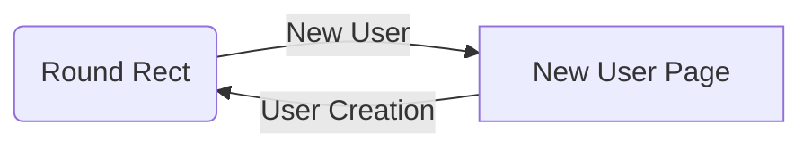

# User Interface Specification Document For User Management Screen

## Pages

 - User list Page
   - Simple button on the top of the page with functionality of redirecting user to New User Page.
   - Checkbox on the top with functionality of showing/Hiding the disabled user on the datatable.
   - 4 columns datatable on the middle part of the page. Each column can be sorted or filtered by the user.
  - New User Page
	- Button on the top of the page with functionality of saving new user.
	- Header with name of "New User"
	- Textbox for the Username, Display Name. 
	- Textbox for phone area with format of (0xxx) xxx xxxx
	- Textbox for email area.
	- Listbox for User Roles. User roles needs to be defined. According to these roles user can be guest, admin or SuperAdmin and have permissions to do actions.
	- Checkbox for the user's enabled status. User can be disabled or enabled.

## UML diagrams

Behavior of the pages:

